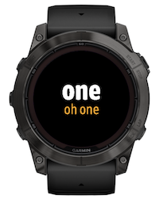
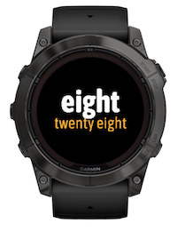
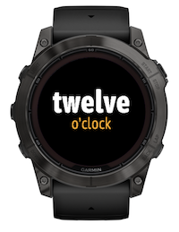

# Garmin English Time

A minimalist, elegant, typography-focused Garmin Connect IQ watch face that displays the current time as English words.





Available from [Garmin Connect IQ Developer portal](https://apps.garmin.com/apps/edae124d-82cc-4572-9ed4-582def4df31b).

## Features

* **Text-Based Time:** Converts digital time into English words.
    * *Top Line:* Hours (Larger, bolder font).
    * *Bottom Line:* Minutes (Smaller, thinner font).

The font used in the current version is Asap Condensed Bold (hours, 80 pixels) and Asap Condensed Light (minutes, 40 pixels).
[Asap TTF](https://fonts.google.com/specimen/Asap) is available from [Google Fonts](https://fonts.google.com).

Future features include:
* **Smart Sizing:** Dynamically adjust font size to ensure long words (like "seventeen" or "twenty seven") always fit the screen width without clipping.
* **AMOLED Friendly:** Include "Always On Display" (AOD) burn-in protection. In sleep mode, the text shifts position slightly every minute to protect pixels.
* **Customization:** Users can change the text color via the Garmin Connect Mobile app settings.
* **Battery Efficient:** Logic optimized to run only once per minute in low-power mode.

---

## Project Structure

```text
EnglishTime/
├── manifest.xml           # App configuration, permissions, and supported devices
├── monkey.jungle          # Project build configuration
├── resources/
│   ├── drawables/         # (Optional) Icon definitions
│   ├── fonts/             # Custom .fnt and .png font files
│   ├── layouts/
│   │   └── layout.xml     # UI definition (Labels for Hours and Minutes)
│   ├── settings/
│   │   └── settings.xml   # User settings menu definition (Color picker)
│   └── strings/
│       └── strings.xml    # App name and setting labels
└── source/
    ├── EnglishTimeApp.mc     # Application entry point & settings listener
    ├── EnglishTimeView.mc    # Main view logic (Draws text, handles burn-in shift)
    └── EnglishTime.mc    # Helper module: Converts Integer time -> String words
```

---

## Prerequisites

1.  **Visual Studio Code** installed.
2.  **Garmin Connect IQ SDK Extension** for VS Code installed.
3.  **Monkey C SDK** downloaded (via the VS Code extension).
4.  **Device Files** downloaded (via SDK Manager) for the watches you want to support (e.g., Epix, Fenix, Venu).

---

## Setup & Configuration

### 1. Font Generation
This project relies on custom fonts. You must generate them before building.

1.  Use a tool like **BMFont** (Windows), **Hiero** (Mac/Linux), or the [ttf2bmp](https://github.com/wkusnierczyk/ttf2bmp) open source tool. (The fonts used currently have been converted using `ttf2bmp`.)

2.  Select your desired font. (The fonts used currently are Asap Condensed Bold and Asap Condensed Light.)

3.  **Optimization:** To save memory, select *only* the characters needed for time telling:
    ```text
    "cefghiklnorstuvwxy' "
    ```
    
    **Note**  
    Ensure you also select the _space_ (` `) character if you want to use it as a separator

4.  Export the fonts as `.fnt` and `.png` pairs. You will likely need several sizes (e.g., ExtraLarge, Large, Medium, Small) to support the dynamic resizing feature (future development).
5.  Place files in `resources/fonts/`.
6.  Register them in `resources/fonts.xml`.
7.  Update `resoures/layouts/layout.xml`.

### 2. Configure SDK
1.  In VS Code, press `Ctrl+Shift+P` (Cmd+Shift+P on Mac).
2.  Type `Monkey C: Open SDK Manager`.
3.  Download the devices you intend to support (e.g., `epix2pro47mm`).

---

## Building & Simulating

### Running in Simulator
The simulator allows you to test the logic, settings, and layouts without a physical watch.

1.  Open `manifest.xml` and ensure your target device is checked in the "Supported Products" tab.
2.  Press `F5` (or go to **Run > Start Debugging**).
3.  Select your target device from the list.
4.  The simulator window will open.

**Testing Settings:**
* In the Simulator, go to **File > Edit Persistent Storage > Edit Application.Properties**.
* This mimics the user changing colors in the phone app.

**Testing Sleep Mode:**
* In the Simulator, go to **Settings > Low Power Mode** (or check the "Low Power" box).
* Watch the text shift slightly (pixel shift) to verify burn-in protection.

---

## Deploying to a Physical Watch (Sideloading)

To test on your real wrist, you need to compile a `.prg` file and manually copy it to the watch.

### 1. Build the App
1.  In VS Code, press `Ctrl+Shift+P`.
2.  Run the command: `Monkey C: Build for Device`.
3.  Select your specific device model (e.g., `fenix7x`).
4.  Select an output folder (usually `bin/`).
5.  This creates a file named `EnglishTime.prg`.

### 2. Copy to Watch
1.  Connect your Garmin watch to your computer via USB.
2.  It should mount as a standard USB drive (MTP or Mass Storage).
3.  Navigate to the drive, then open the folder: `Garmin/Apps/`.
4.  Drag and drop your `EnglishTime.prg` file into this folder.

### 3. Run
1.  Disconnect the USB cable.
2.  On the watch, go to **Watch Face** selection.
3.  Your app should appear in the list.

**Note**  
Sideloaded apps do not automatically create a settings menu in the Garmin Connect mobile app on your phone. To test settings on a real device, you must upload a Beta version to the Connect IQ Store, or rely on Simulator testing.

---

## Contributing

Contributions are welcome! Here is how you can help improve EnglishTime.

1.  Fork the repository from [github.com/wkusnierczyk/garmin-word-face](https://github.com/wkusnierczyk/garmin-word-face).
2.  Create a feature branch (`git checkout -b feature/AmazingFeature`).
3.  Commit your changes (`git commit -m 'Add AmazingFeature'`).
4.  Push to the branch (`git push origin feature/AmazingFeature`).
5.  Open a Pull Request.
