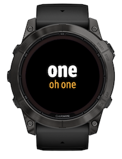
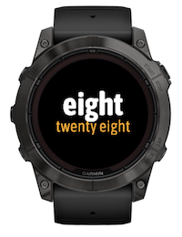
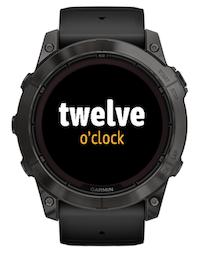

# Garmin English Time

A minimalist, elegant, typography-focused Garmin Connect IQ watch face that displays the current time as English words.





Available from [Garmin Connect IQ Developer portal](https://apps.garmin.com/apps/edae124d-82cc-4572-9ed4-582def4df31b).

## Contents

* [English time](#english-time)
* [Fonts](#fonts)
* [Build, test, deploy](#build-test-deploy)

## English time

The English Time watch face uses English words to show the time in two rows:
* First row: hour, in larger, bold font.
* Second row: minutes, in smaller, regular, colored font.

The English words include:
* all numerals from `one` to `fifty nine`;
* `o'clock` to indicate a full hour (zero minutes), as in `one o'clock`;
* `oh` to indicate unit minutes (no tens), as in `one oh five`.

## Fonts

The English Time watch face uses custom fonts:

* [Asap Condensed](https://fonts.google.com/specimen/Asap) for hour (AsapCondensed bold) and minutes (AsapCondensed light) words.

The font development process was as follows:

* The fonts were downloaded from [Google Fonts](https://fonts.google.com/) as True Type  (`.ttf`) fonts.
* The fonts were converted to bitmaps as `.fnt` and `.png` pairs using the open source command-line [`ttf2bmp`](https://github.com/wkusnierczyk/ttf2bmp) converter.
* The font sizes were established to match the Garmin Fenix 7X Solar watch 280x280 pixel screen resolution.
* The fonts were then scaled proportionally to match other screen sizes available on Garmin watches with round screens using the included [utility script](utils/generate_fonts.py).

The table below lists all font sizes provided for the supported screen resolutions.

| Element | Font                | 218 | 240 | 260 | 280 | 360 | 390 | 416 | 454 |
| :------ | :------------------ | --: | --: | --: | --: | --: | --: | --: | --: |
| Hours   | AsapCondensed bold  |  62 |  69 |  74 |  80 | 103 | 111 | 119 | 130 |
| Minutes | AsapCondensed light |  31 |  34 |  37 |  40 |  51 |  56 |  59 |  65 |

---

## Build, test, deploy

To modify and build the sources, you need to have installed:

* [Visual Studio Code](https://code.visualstudio.com/) with [Monkey C extension](https://developer.garmin.com/connect-iq/reference-guides/visual-studio-code-extension/).
* [Garmin Connect IQ SDK](https://developer.garmin.com/connect-iq/sdk/).

Consult [Monkey C Visual Studio Code Extension](https://developer.garmin.com/connect-iq/reference-guides/visual-studio-code-extension/) for how to execute commands such as `build` and `test` to the Monkey C runtime.

You can use the included `Makefile` to conveniently trigger some of the actions from the command line.

```bash
# build binaries from sources
make build

# run unit tests
make test

# run the simulation
make run
```

To sideload your application to your Garmin watch, see [developer.garmin.com/connect-iq/connect-iq-basics/your-first-app](https://developer.garmin.com/connect-iq/connect-iq-basics/your-first-app/).